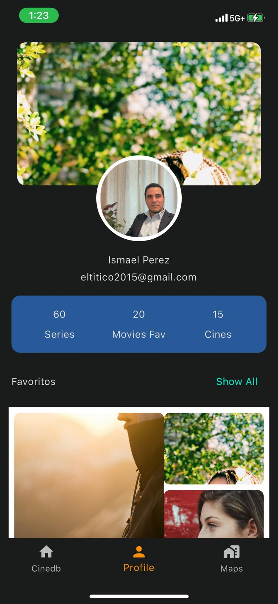

## Movies App 🎬
Aplicación móvil desarrollada en Flutter para consultar información y trailers de películas populares consumiendo la API TheMovieDB.

# Capturas de Pantalla



# Funcionalidades
Consulta el catálogo de películas populares, mejor valoradas y próximos estrenos
Búsqueda de películas
Ver detalle, reparto, trailers de cada película
Gestión de perfil de usuario
Guardar películas favoritas en la base de datos
y almacenamiento de imagenes con Firestore

# Arquitectura
La arquitectura elegida para esta aplicación es arquitectura limpia, segregando las responsabilidades en tres capas:

Domain: Aquí residen las entidades y reglas de negocio
Infrastructure: Capa de acceso a datos, comunicación con API REST y Base de datos
Presentation: Interfaz gráfica y lógica de presentación, gestor de estado, etc.

Esta separación facilita el mantenimiento y la escalabilidad del software y favorece el bajo acoplamiento entre capas.

Por otra parte, he decidido usar Provider como gestor de estado dada su facilidad de integracion y simpleza, brindando a su vez buen performance a la app.

También estoy usando getx para la inyección de dependencia

# Persistencia de datos
Para la persistencia d e datoslocal he optado por Isar NoSql DB por sus ventajas de rendimiento. 

Benchmarks only give a rough idea of the performance of a database but as you can see, Isar NoSQL database is quite fast 😇

|  |  |
| ---------------------------------------------------------------------------------------------------------------- | --------------------------------------------------------------------------------------------------------------- |
|  |   |

If you are interested in more benchmarks or want to check how Isar performs on your device you can run the [benchmarks](https://github.com/isar/isar_benchmark) yourself.


# Dependencias utilizadas
dio
get
provider
path_provider
cached_network_image
isar
isar_flutter_libs
image_picker
firebase_core
firebase_storage

# Instalación
Clonar repositorio
Ejecutar flutter pub get para instalar dependencias
```
flutter pub get
```
Ejecutar la app con flutter run

